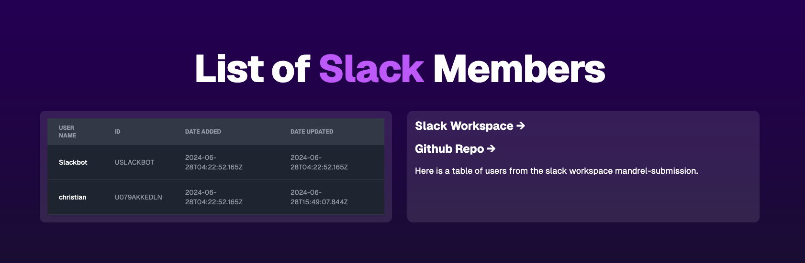

# Mandrel Submission
The running solution is located at https://crane-enjoyed-presumably.ngrok-free.app/
## Description
This is a [T3 Stack](https://create.t3.gg/) project bootstrapped with `create-t3-app` using the following tools.
- [Next.js](https://nextjs.org)
- [Prisma](https://prisma.io)
- [Tailwind CSS](https://tailwindcss.com)

Currently, as an MVP we only capture `name`. To test simply change your name in Slack and the changes will reflect in the table on the UI. 
## Requirements
- Node.js 
- Postgres Database (Instructions are in `./primsa/prisma.schema` otherwise `sqlite` works builtin)
- Docker and Make(if you choose to use `docker`)

## Instructions
If you'd like to use `docker` to spin up your database, all you need to run is `make db`. After that run `npm i` and you should be able to run `npm run db:migrate` to generate your db models in `prisma.schema`.

You will need to generate you own slack app to generate an auth token to fill in the environment variable `SLACK_TOKEN`. You should be able to paste the text in `manifest.yaml` when creating your own app.

To authenticate webhooks/Event Subscriptions you will need to forward traffic to the `/slack` route. We recommend using [ngrok](http://www.ngrok.com) to test. Once dowloaded and set up you should be able to run `ngrok http 3000` to generate a url to paste.

After that, you can open your browser to either `localhost:3000` or the URL `ngrok` provided for you to see a table like the picture below. If everything is working your users in your Slack workspace should have synced and changes will now be forwarded to the database, updating the table.

To run tests using [jest](http://jest.com) run `npm t` 

# TODO
- Add more fields to model so we capture updates to users other than `name`
- Add testing for all the messages that `/slack` will be receiving. 
- Add factories to testing to add fake data
- Setup test database
- Setup Authentication so we can distribute app on the marketplace (we could use [NextAuth.js](https://next-auth.js.org))
- Host database on something like [heroku](http://heroku.com) (there is an example hosted [here as well](https://mandrel-submission-64429abb8839.herokuapp.com/) with no data because there is no database)
